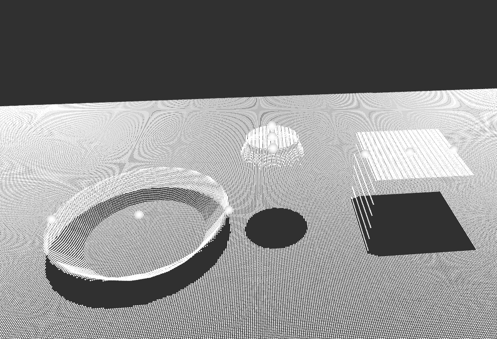

# RBE 595 - Vision-based Robotic Manipulation

## Grasping from Top Surfaces
This repo contains a ROS2 and Gazebo project developed for the RBE 595 group project.

### Abstract

In this repo, the development of a top-surface grasping algorithm was explored. This is a key task in robotic manipulation that enhances a robot’s ability to interact with objects in cluttered or constrained environments. Utilizing the work of Richtsfeld and Vincze as reference, point cloud data techniques were implemented, focusing on surface normal estimation and grasp point detection. Two implementations utilizing concave hulls approaches from different libraries were evaluated, yielding consistent results in grasp point identification and quality metrics. The challenges and future work are proposed to improve the grasping pipeline.



A full write up of the project can be seen in the `docs` folder.

## Team Members

Azzam Shaikh, Niranjan Kumar Ilampooranan, Swati Shirke, Alex Brattstrom, Chaitanya Gokule

## Run Instructions
### Building the workspace
Go to the `ros2_ws` folder:
```
cd ros2_ws
```

Check for missing dependencies:
```
rosdep install -i --from-path src --rosdistro humble -y
```

Build the workspace and source the environment. The `--parallel-workers NUMBER` argument can be passed to the `colcon build` command to prevent any crashes. 
```
colcon build && source install/setup.bash
```

### Launching the simulation
Use the following command to launch the sim using the PCL implementation.
```
ros2 launch vbm_project_env simulation_pcl.launch.py
```

Use the following command to launch the sim using the alphashape implementation.
```
ros2 launch vbm_project_env simulation_alphashape.launch.py
```


